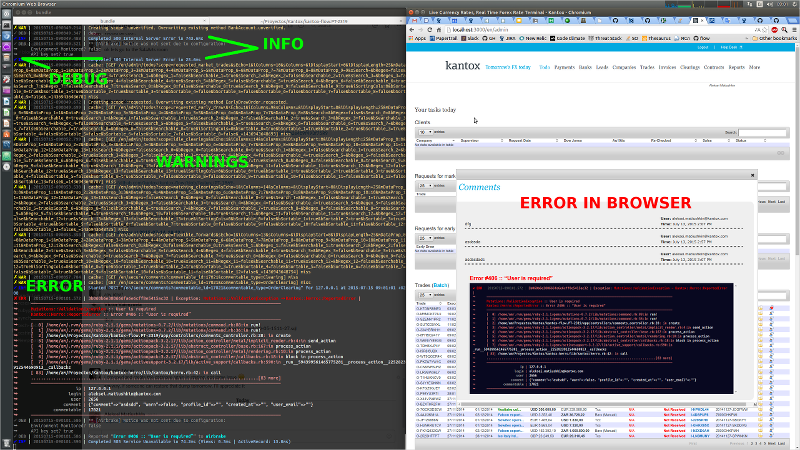

# Kantox::Herro

Better log for Rails (and plain ruby.)



```ruby
it 'logs out the exception' do
  Kantox::LOGGER.err ArgumentError.new('I am an Argument Error'), 5

  Kantox::LOGGER.wrn 'I am a WARNING'
  Kantox::LOGGER.nfo ['I am an INFO WITH TRACE']
  Kantox::LOGGER.wrn 'I am a WARNING', user: 'Aleksei', ip: '8.8.8.8'
  Kantox::LOGGER.err 'I am an ERROR'

  Kantox::LOGGER.nfo ['I am an INFO WITH TRACE'], user: 'Aleksei', ip: '8.8.8.8'
  Kantox::LOGGER.dbg ['I am a DEBUG WITH TRACE']
  end

  it 'reports errors properly' do
    expect {Kantox.error 'Hey there'}.to raise_error(Kantox::Herro::ReportedError)
  end

  it 'raises errors properly in rails' do
    begin
      @comment = CreateComment.run!(comment_params)
      render json: @comment.to_json(only: %i[comment created_at id],
                                    methods: :user_email,
                                    root: false)
    rescue  Mutations::ValidationException,
          ActiveRecord::ActiveRecordError,
          Workflow::TransitionHalted,
          Exception

      trumpet_error $!, 406, comment: params[:comment],
                             commentable: @commentable.id
    end
  end
```

## Installation

Add this line to your application's Gemfile:

```ruby
gem 'kantox-herro'
```

And then execute:

    $ bundle

Or install it yourself as:

    $ gem install kantox-herro

## Usage

```ruby
  # Write log message, throw wrapped into `ReportedError` original exception:
  Kantox.error ArgumentError.new('I am an Argument Error')

  # Write log message including stack trace, return clean formatted text:
  formatted = Kantox::LOGGER.wrn ['Warning']

  # rails, inside rescue clause:
  trumpet_error $!, 503, param: params[:param],
                         email: surrent_user.email
```

## Rails

To use herro in Rails, one introduces the initializer:

**config/initializers/herro.rb**

```ruby
require 'kantox/herro'

begin
  require 'rack/cache'
rescue LoadError => e
  puts "Couldn't find rack-cache - make sure you have it in your Gemfile:"
  puts "  gem 'rack-cache', :require => 'rack/cache'"
end

Kantox::Herro.config(File.join Rails.root, 'config', 'herro.yml') do |c|
  c.log!.root = Rails.root
end
# In current version this should be done after initialization (⇑)
#     to reflect `Rails.logger`
Kantox::LOGGER = Kantox::Herro::Log.new

if Kantox::Herro.config.log!.rack
  Rails.application.middleware.insert_before Rack::Cache, Kantox::HackMiddlewareSettings, :kantox_web
end
```

Life example (generic handler in `application_controller.rb`):

```ruby
  def trumpet_error exception, status = 503, **extended
    extended = {
        __id__: request.session_options[:id],
        ip: request.env["HTTP_X_FORWARDED_FOR"] || request.remote_ip,
        login: (current_user.login rescue nil)
      }.merge(
      %i(session user client company).map do |who|
        [who, public_send("current_#{who}")]
      end.map do |who, value|
        value.nil? || value.id.nil? ? nil : [who, value.id]
      end.compact.to_h
    ).merge(extended)
    Kantox.error exception, status, extended
  end

```

### To view logs in `vim` with pleasure

    http://www.vim.org/scripts/script.php?script_id=302

To enable the above:

    :AnsiEsc

In your `~/.vimrc`:

    " ================ Folds ============================
    set foldmethod=expr
    set foldexpr=getline(v:lnum)=~\"⮩\"
    set foldnestmax=3       "deepest fold is 3 levels


## Development

After checking out the repo, run `bin/setup` to install dependencies. Then, run `rake rspec` to run the tests. You can also run `bin/console` for an interactive prompt that will allow you to experiment.

To install this gem onto your local machine, run `bundle exec rake install`. To release a new version, update the version number in `version.rb`, and then run `bundle exec rake release`, which will create a git tag for the version, push git commits and tags, and push the `.gem` file to [rubygems.org](https://rubygems.org).

## Contributing

Bug reports and pull requests are welcome on GitHub at https://github.com/[USERNAME]/kantox-herro. This project is intended to be a safe, welcoming space for collaboration, and contributors are expected to adhere to the [Contributor Covenant](contributor-covenant.org) code of conduct.


## License

The gem is available as open source under the terms of the [MIT License](http://opensource.org/licenses/MIT).
